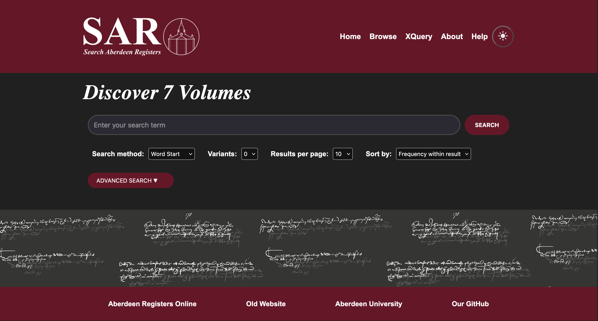
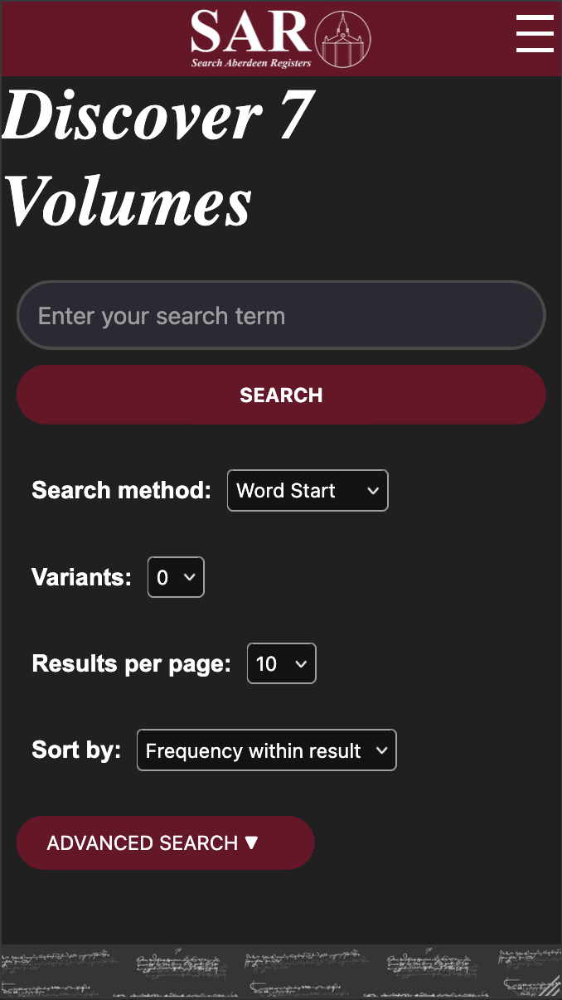
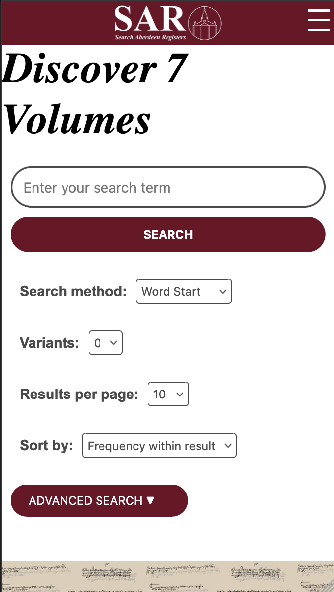

# SAR-Project

New Search Aberdeen Registers (SAR) search tool web application project
 A modernised, maintainable version of [sar.abdn.ac.uk](sar.abdn.ac.uk)
  Project implementation seen at [sar2.andreasmaita.com](http://sar2.andreasmaita.com)
  We are going to get an A1!!
  ☆*: .｡. o(≧▽≦)o .｡.:*☆

  
  

  
  

## Team Lima

**Developers:** Caitlin Thaeler, Piotr Smialek, Holly Sinclair, Andreas Maita, Fariha Ibnat, Rebekah Leslie, Haziel Osunde, Dermot Stelfox
 For CS3028 Principles of Software Engineering, University of Aberdeen

## Instructions for Running the Project

If you are not a member of our organisation, you may either want to create a fork of this repository so you can clone it on your device, or simply download the search-app directory using [this link](https://download-directory.github.io/?url=https://github.com/GroupLima/SAR-Repo/tree/main/search-app). If you are using WSL + GitHub Desktop to clone the project, you will need to map your network drive if you haven't done so already so that GitHub Desktop knows the correct location to clone the repo.

Now, you will need to install a few packages and dependencies in order to run the Laravel project. The following instructions are for Linux or WSL environments, but you should also be able to successfully run the website on macOS as well.

### Download PHP, Laravel and Composer:

#### Linux (Debian-based)

1. `sudo apt update && sudo apt upgrade`
2. `sudo apt install nodejs unzip`
3. Install PHP for your system: `/bin/bash -c "$(curl -fsSL https://php.new/install/linux)"`
4. `sudo apt-get install php-mbstring php-xml php-json php-zip php-curl`

#### macOS

1. Assuming you have [Homebrew](https://docs.brew.sh/Installation) installed, otherwise substitute `brew` in the following commands for your package manager.
2. `brew upgrade`
3. Install system requirements: `brew install nodejs unzip php-mbstring php-xml php-json php-zip php-curl`
4. Install PHP for your system: `/bin/bash -c "$(curl -fsSL https://php.new/install/mac)"`

### Running the Project

#### Back-End

1. Go to the back-end directory: `cd search-app/back-end`
2. If this is the first time running, or a Python virtual environment is not set up, then run the command: `python3 -m venv venv-sar`
3. Source the Python virtual environment: `source venv-sar/bin/activate` or if not working then `. venv-sar/bin/activate`
4. Install the Python requirements (only on first setup/run): `pip install -r requirements.txt`
5. Install the Composer requirements (only on first setup/run): `composer install`
6. Run PHP server using: `php artisan serve`

#### Front-End

1. Open a second terminal, keeping the first running.
2. Go to the front-end directory: `cd search-app/front-end`
3. Install NPM requirements (only on first setup/run): `npm install`
4. Run Vite Server with Vue tooling:
   1. Deploy site and run regularly with:
      1. Compile site only on first run / site changes being made: `npm run build`
      2. Run with: `npm run preview`
   2. **Not for deployment because it has dev privileges:** `npm run dev`

#### Docker Run

The following are instructions to run the project with Docker. Do not run the front & back end as well as this simultaneously - only either the Docker or both the front and back end being run will serve the project.

1. Ensure you have Docker installed using the official guide: [Docker Installation](https://docs.docker.com/engine/install/)
2. Start the Docker Daemon for your system:
   1. For Linux: `sudo systemctl start docker`
   2. For macOS: Start the GUI application (as of writing no easy way to do this from the terminal)
3. From the root of the project (SAR-Repo) run the command: `docker-compose up --build`

##### Maintenance

1. Stop the containers with: `docker-compose down`
2. Enter a specific container within the project (back/front-end):
   1. List running containers with: `docker ps`
   2. Enter the shell of the container with: `docker exec -it <container_id_or_name> /bin/sh`, replacing the variable with the desired container ID or name.

##### Rebuilding Specific Apps

If you need to rebuild only certain apps (e.g., `sar-repo-backend-1` or `sar-repo-frontend-1`) while the project is still running, you can use the following commands:

1. Rebuild and restart a specific service:
   `docker-compose up --build <service_name>`
   Replace `<service_name>` with the name of the service you want to rebuild (e.g., `sar-repo-backend-1` or `sar-repo-frontend-1`).

2. Restart a specific service without rebuilding:
   `docker-compose restart <service_name>`
   Replace `<service_name>` with the name of the service you want to restart.

##### Other Useful Docker Commands

1. View logs of a specific container:
   `docker logs <container_id_or_name>`
   Replace `<container_id_or_name>` with the ID or name of the container.

2. Follow logs of a specific container in real-time:
   `docker logs -f <container_id_or_name>`

3. Stop all running containers:
   `docker stop $(docker ps -q)`

### existDB setup
1. On first time installing existdb we have to download it from the web
   1. Use this https://github.com/eXist-db/exist/releases/tag/eXist-6.3.0
   2. Please download exist-distribution-6.3.0-unix.tar.bz2
   3. Navigate to where you downloaded the folder.
   4. run this `tar -xvjf exist-distribution-6.3.0-unix.tar.bz2`
   5. this should create a folder called this; exist-distribution-6.3.0
   6. cd to this folder on the terminal
   7. run `bin/startup.sh`
   8. Now, open http://localhost:8080/exist/
   9. Click on eXide - Xquery IDE
   10. Click file, then Manage
   11. The username is `admin`
   12. the password is `` (blank)
   13. somewhere create a new folder called xmlfiles 
   14. put both xml 1-7 and volume 8 directories from into it called search-app/back-end/storage/app/xml-files
   15. then go to file, manage, upload, then directories and upload this xmlfiles folder
   16. Once uploaded click close. 
   17. now try out the existdb site!!!
2. If installed just filed the existdb folder in terminal and run `bin/startup.sh`and procee