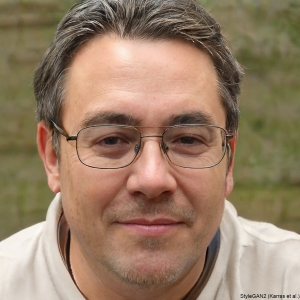

<strong><ins>Alma Baker, 34</ins></strong>

Alma is a historical academic researcher at the University of Pennsylvania, with a special interest in Scottish history because of her 1/15th heritage. She is very much a people-person and loves talking about her work. She recharges at the weekend by taking her pet ferrets for a walk in the park. One of her flaws is disliking to ask for help and prefers an intuitive mechanism. Many of her PhD colleagues describe Alma as a warm, kind soul but when it comes to her work she isn't afraid to use colourful language to point out inaccuracies others publish - as she believes misinformation is one of the deadliest threats of the modern world.

<strong><ins>Calvin Woods, 38</ins></strong>

Calvin has been working at Timpson as a locksmith for a decade. He was born and raised in Aberdeen and always loved the stories his grandmother would tell him about his long heritage within his hometown. He never was the most tech-savvy, aside from when he occasionally surfs the web on the weekends. Given his line of work there is much alone time and a fair few of his customers would describe Calvin as stoic in nature - a man of few words.

<strong><ins>Rida Cook, 22</ins></strong>

Rida has taken a few gap years to travel but has recently found a passion for learning about the origins of different civilisations, and as a result enrolled in a university history course to channel her energy. She enjoyed computer science back in her early school days and is excited about exploring every nook-and-cranny especially settings and advanced features that the standard user may not use. Rida also works a part-time job at a game store to afford commuting to her University. She is a very outdoor person and thrives whilst hiking and exploring her neighbourhood - one of her favourite pastimes is finding a secluded spot and write anything she can such journaling any experience she's had, or more recently delve into taking notes of her studies.

[Photo_Source - This_Person_Does_Not_Exist](https://thispersondoesnotexist.com/)